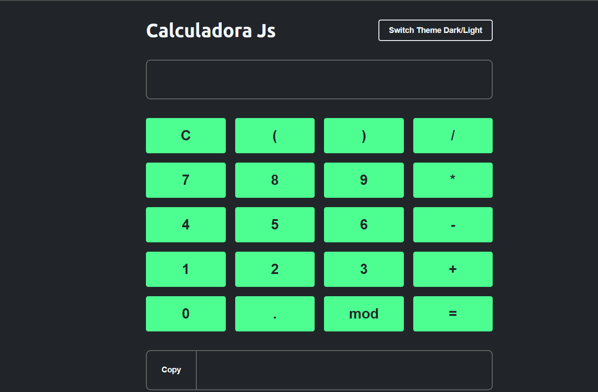

#  8 Mini Projetos com javascript puro

<table border="2">
  <tr>
    <td>
        <h3>Cadastro de imóveis</h3>
        <li><a href="./cadastroImoveis/">Código</a></li>
        
    </td>
      <td>
        <h3>Calculadora</h3>
        <li><a href="./calculadora/">Código</a></li>
        
    </td>
    <td>
      <h3>Calculadora Imc</h3>
      <li><a href="./calculadoraImc/">Código</a></li>
      
    </td>
  </tr>
  <tr>
    <td>
      <h3>Lâmpada</h3>
      <li><a href="./lampada">Código</a></li>
      
    </td>
    <td>
      <h3>Semafaro</h3>
      <li><a href="./semafaro/">Código</a></li>
      
    </td>
    <td>
      <h3>slide Show</h3>
      <li><a href="./slideShow/">Código</a></li>
      
    </td>
  </tr>
  <tr>
    <td>
      <h3>To-do-list</h3>
      <li><a href="./todoList/">Código</a></li>
      
    </td>
     <td>
      <h3>Crud</h3>
      <li><a href="./crud/">Código</a></li>
      
    </td>
  </tr>
  
</table>
